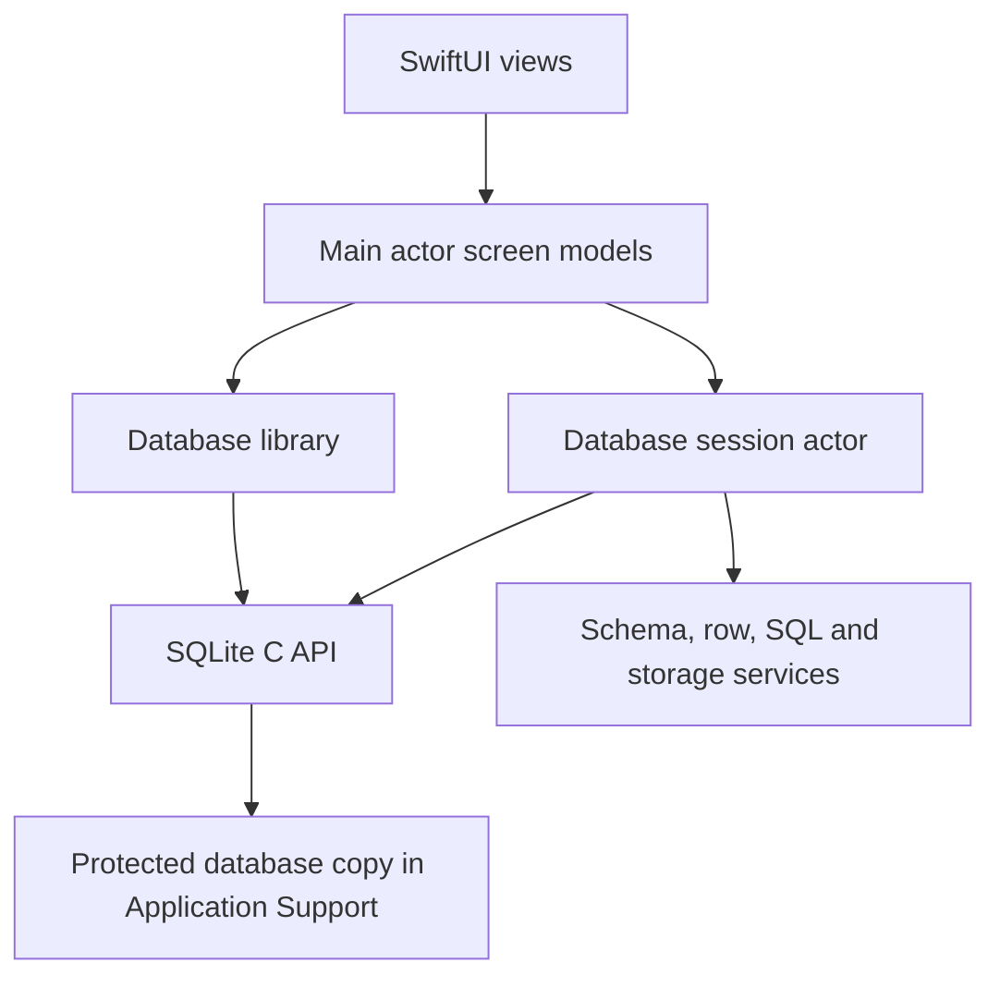

# SQLite Viewer architecture

## Product contract

SQLite Viewer is an iPhone and iPad tool for inspecting and editing an imported SQLite database. Import creates an independent copy inside the app container. Opening a database creates a connection to that copy. The user can inspect schema objects, indexes, table rows, and storage use, and run raw SQL, including statements that change data or schema. The app never executes SQL against the original URL.

The current repository is an Xcode SwiftUI starter project. It targets iOS 26.5, uses Swift 5 language mode, and has unit and UI test targets. `Specs/` is included in the app target by Xcode's synchronized group. Implementation plans must keep Markdown files out of the app bundle if Xcode starts treating them as resources.

## Architecture

- `DatabaseLibrary` owns imports, stable IDs, display names, deletion, and the active database URL. Store each database in `Application Support/Databases/<UUID>/database.sqlite` with a small manifest. Exclude the directory from iCloud backup and apply complete file protection to the directory, database, and SQLite sidecars. A locked device may suspend access and the UI must show a recoverable error.
- `DatabaseSession` is an actor that owns exactly one `sqlite3*` connection. Keep all prepare, bind, step, finalize, and close calls on that actor. Never pass a statement or raw connection pointer into a SwiftUI view or another actor. Limit retained result rows. For cancellation, install a SQLite progress callback that reads a thread-safe flag the UI can set while the actor is busy.
- Use the official SQLite amalgamation, version 3.53.4, compiled into the app with `SQLITE_ENABLE_DBSTAT_VTAB` and `SQLITE_OMIT_LOAD_EXTENSION`. Keep `sqlite3.c`, `sqlite3.h`, and source/checksum notes in the repository. Do not link Apple's separate `libsqlite3` into the app target. This makes storage analysis available on every supported device.
- `SchemaService` reads `sqlite_schema` plus SQLite PRAGMAs for table columns and index details. `RowsService` uses quoted identifiers, prepared statements, and pages of 100 rows. `SQLService` prepares and runs user SQL statement by statement, returning column names, typed values, affected row count, elapsed time, and errors. `StorageService` uses `dbstat` for B-tree page sizes and PRAGMAs for page size, page count, and freelist count.
- SwiftUI navigation starts with a library of imported databases, then a database workspace with Schema, Rows, Storage, and SQL destinations. iPad can use a sidebar and detail pane; iPhone can use a compact stack or tabs. A grid scrolls horizontally for columns and vertically through paged rows. SQL output uses the same grid component in read-only mode.

## Data and behavior rules

1. Import through `fileImporter`. Hold the security-scoped resource only while importing. Open the source read-only and use SQLite's online backup API to create a consistent local snapshot in a staging directory. Validate with `PRAGMA quick_check`, close both connections, then move the completed import into the library. On failure, remove staging files. The backup API preserves a database snapshot, including committed WAL content when SQLite can access the source sidecars. Files supplied without accessible WAL sidecars may lack uncheckpointed transactions; explain this limitation in the import UI.
2. Imported copies are writable because the SQL console supports writes. The app asks no extra confirmation for a submitted command. SQL errors must never be hidden, and changes must refresh schema, grid, and storage screens. Writes affect only the imported copy.
3. Quote every database identifier by doubling embedded double quotes. Never interpolate user values into generated SQL. Allow arbitrary SQL text in the console, but keep generated schema and grid queries separate from that text. Disable SQLite extension loading.
4. Keep NULL, integer, real, text, and BLOB distinct in the data model. The grid renders NULL explicitly and gives BLOBs a byte count and short hex preview. Do not silently coerce a large integer through `Double`.
5. Storage numbers describe the imported database's logical pages. Report a table's own B-tree separately from its indexes, and provide an inclusive total. Database totals also show free pages and remaining overhead so categories reconcile with `page_count * page_size`. Views have no own storage. Show WAL sidecar bytes separately when present; they are not part of the logical page distribution.
6. A failed import, invalid database, unsupported object, locked file, or SQL error must leave the app usable and give a concrete error. Large databases must not load every row into memory.

## Execution order

Run [01 SQLite core](01-sqlite-core.md), [02 import and library](02-import-library.md), [03 schema browser](03-schema-browser.md), [04 row grid](04-row-grid.md), [05 SQL console](05-sql-console.md), [06 storage analysis](06-storage-analysis.md), then [07 integration and release checks](07-integration.md). Each plan contains its own planning, implementation, testing, review, and commit steps. At the start of each plan, inspect the current code and recent commits; the repository is the source of truth. No separate result or handoff file is required.

## Reference behavior

- [Apple `fileImporter` and security-scoped resource access](https://developer.apple.com/documentation/swiftui/view/fileimporter%28ispresented%3Aallowedcontenttypes%3Aallowsmultipleselection%3Aoncompletion%3Aoncancellation%3A%29)
- [Apple complete file protection](https://developer.apple.com/documentation/foundation/fileprotectiontype/complete)
- [SQLite online backup API](https://www.sqlite.org/backup.html)
- [SQLite `dbstat`](https://www.sqlite.org/dbstat.html)
- [SQLite query progress callbacks](https://www.sqlite.org/c3ref/progress_handler.html)
- [SQLite schema PRAGMAs](https://www.sqlite.org/pragma.html)
- [SQLite amalgamation 3.53.4 download and checksum](https://www.sqlite.org/download.html)
